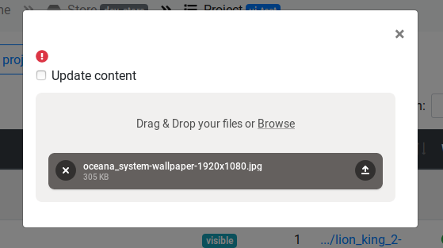
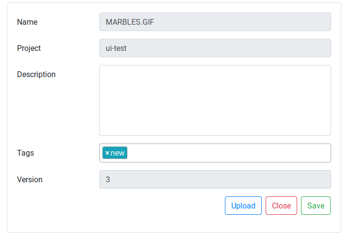

# Using OVE Asset Manager

The OVE asset manager interface presents two main views: a table of workers, and a hierarchy of *stores*, *projects* and *assets*, each represented by a table.

## Managing workers

Workers are separate programs that can asynchronously process files (e.g., to convert it to a new file format, expand a zip archive, or apply a layout algorithm to a file describing a network).

When a worker program starts running, it automatically *registers* itself with the Asset Manager using a REST API. 
Multiple instances of the same `type` of worker can register with the same instance of the Asset Manager.

The status column indicates whether the worker instance is `ready` (white tick in green circle), currently `processing` a file (spinning circles), or has encountered an `error` (exclamation mark in circle); worker status can be reset to `ready` by clicking on the button with a reset icon.

A worker should automatically de-register itself when it stops running, but it is also possible to manually de-register a worker by clicking on the button with a trash can icon.

The documentation for a worker can be viewed by clicking on the button with a book icon.

## Managing projects and assets

The **home page** displays a list of S3 compatible object *stores*; selecting a store opens a list of the *projects* it contains.

### Project list

You can create a new project by typing its name into the input box and pressing the button with an icon that is a plus sign superimposed on a folder.

From the **project list**, you can edit the details of a project by clicking on the pencil icon, or list the **assets** in the project by clicking on either the project name or the folder icon.

### Asset list

From a project's **asset list**, you can add assets to a project in one of two ways:

* You can click on the `Upload` button, and select one or more files to upload. An asset will be automatically created for each file, with an asset name determined by the filename, as seen in the image bellow:

* Alternatively, you can manually create an asset by clicking on the `New Asset` button, enter the asset name, and click `Save`. 

You can then add an asset to this file from the Edit Asset page, which the asset creation page will automatically redirect to after it is submitted, or by clicking the upload icon.
Regardless of how the asset was originally created, you can use these methods to upload a modified file. 

A worker can be instructed to process an asset by clicking on the button with a paint-roller icon.

After being processed by a worker, an asset may contain multiple files (e.g., because a zip file has been expanded into a directory, or because an image has been decomposed into tiles). 
Clicking the button with a checklist icon lists the contents of an asset, with a link that allows each to be opened.
Regardless of the number of a files in an asset, there will be a single file designated as the *Index File*; a link to this is provided in a column of the asset table.

As well as assets, a project can contain a *project file*, which explains how its assets should be displayed by OVE.
This file can be edited (or created if it does not yet exist) by clicking on the `Edit project file` button above the table.

